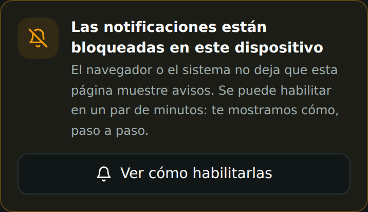
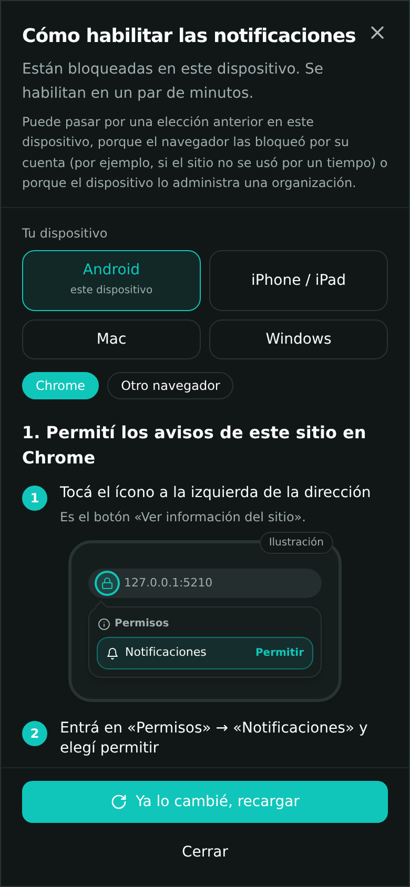
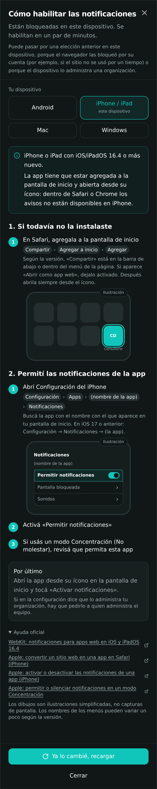
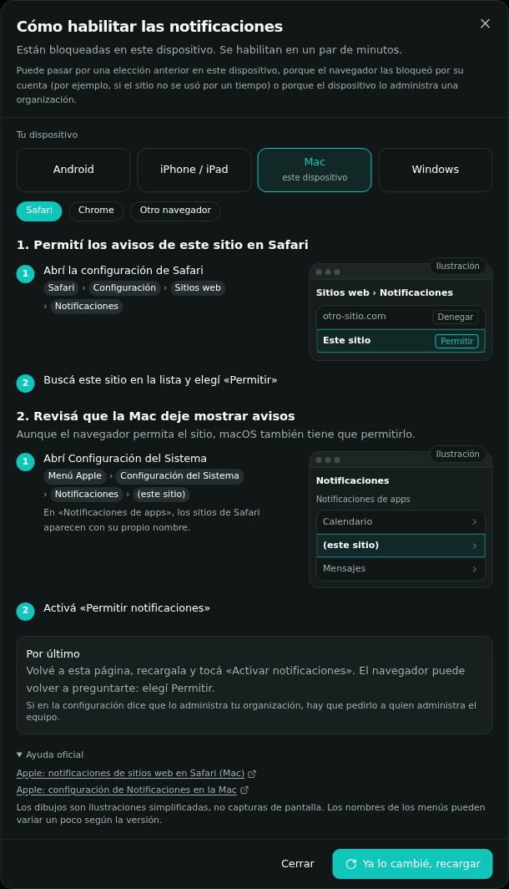
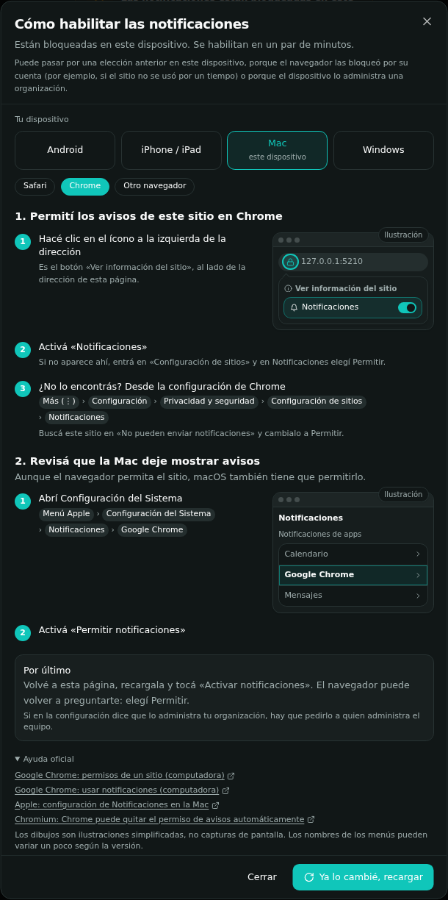
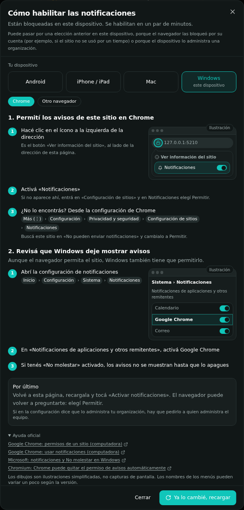

# Ayuda: notificaciones bloqueadas

Cuando `Notification.permission` es `denied`, la tarjeta de avisos (portal del paciente y configuración del consultorio) muestra un mensaje neutral y el botón **«Ver cómo habilitarlas»**, que abre una guía paso a paso.

- **Sin culpar a nadie.** Solo sabemos que el navegador o el sistema no deja mostrar avisos. Puede venir de una elección anterior, de un bloqueo automático del navegador (Chrome puede bloquearlos o quitar el permiso a sitios poco usados) o de una política del dispositivo.
- **Sin pedir permiso por su cuenta.** La guía solo explica. El permiso se pide únicamente al tocar «Activar notificaciones», como exigen los navegadores.
- **Por plataforma.** Se sugiere la plataforma detectada y se puede elegir otra:
  - Android: Chrome u otro navegador;
  - iPhone/iPad;
  - Mac: Safari, Chrome u otro navegador;
  - Windows: Chrome u otro navegador.
- **Ilustraciones, no capturas.** Los dibujos de la guía son diagramas simplificados con la etiqueta «Ilustración». No reproducen la apariencia exacta de cada sistema.

Código: `src/lib/notification-help.ts` (contenido y detección), `src/components/notifications/` (modal e ilustraciones), `src/components/NotificationActivationCard.tsx`.

## Pasos y fuentes oficiales

Las fuentes se revisaron el 6/10/2026 con búsquedas limitadas a los dominios oficiales. Las páginas no se pudieron abrir directamente desde el entorno de desarrollo. Los nombres de menú en español pueden variar un poco según la versión y el idioma del sistema.

| Plataforma | Pasos de la guía | Fuente |
|---|---|---|
| Chrome (computadora), permiso del sitio | Ícono a la izquierda de la dirección («Ver información del sitio») → activar Notificaciones. Alternativa: Más → Configuración → Privacidad y seguridad → Configuración de sitios → Notificaciones | [Permisos de un sitio](https://support.google.com/chrome/answer/114662?hl=es-419&co=GENIE.Platform%3DDesktop) · [Usar notificaciones](https://support.google.com/chrome/answer/3220216?hl=es-419&co=GENIE.Platform%3DDesktop) |
| Chrome (Android), permiso del sitio | Ícono a la izquierda de la dirección → Permisos → Notificaciones. Alternativa: Más → Configuración → Configuración de sitios → Notificaciones | [Permisos de un sitio](https://support.google.com/chrome/answer/114662?hl=es-419&co=GENIE.Platform%3DAndroid) · [Usar notificaciones](https://support.google.com/chrome/answer/3220216?hl=es-419&co=GENIE.Platform%3DAndroid) |
| Android, sistema | Configuración → Notificaciones → Notificaciones de apps → Chrome (varía según el fabricante) | [Controlar notificaciones en Android](https://support.google.com/android/answer/9079661?hl=es-419) |
| Chrome, bloqueo automático | Chrome puede bloquear avisos o quitar el permiso a sitios con poca interacción | [Chromium Blog, oct. 2025](https://blog.chromium.org/2025/10/automatic-notification-permission.html) · [Usar notificaciones](https://support.google.com/chrome/answer/3220216?hl=es-419&co=GENIE.Platform%3DDesktop) |
| iPhone/iPad, requisitos | iOS/iPadOS 16.4 o posterior; la app agregada a la pantalla de inicio y abierta desde su ícono; el permiso se pide con un toque en la app. Dentro de Safari no hay avisos web | [WebKit: Web Push en iOS 16.4](https://webkit.org/blog/13878/web-push-for-web-apps-on-ios-and-ipados/) · [Convertir un sitio en app](https://support.apple.com/guide/iphone/open-as-web-app-iphea86e5236/ios) |
| iPhone/iPad, permiso | Configuración → Apps → (app) → Notificaciones → Permitir notificaciones. En iOS 17 o anterior: Configuración → Notificaciones → (app). Revisar los modos Concentración | [Notificaciones de una app](https://support.apple.com/es-lamr/120681) · [Concentración](https://support.apple.com/guide/iphone/allow-or-silence-notifications-for-a-focus-iph21d43af5b/ios) |
| Safari (Mac) | Safari → Configuración → Sitios web → Notificaciones → el sitio en Permitir | [Notificaciones de sitios en Safari](https://support.apple.com/guide/safari/customize-website-notifications-sfri40734/mac) |
| macOS, sistema | Configuración del Sistema → Notificaciones → (Notificaciones de apps) Google Chrome o el sitio de Safari → Permitir notificaciones | [Notificaciones en la Mac](https://support.apple.com/guide/mac-help/change-notifications-settings-on-mac-mchl205da693/mac) |
| Windows, sistema | Inicio → Configuración → Sistema → Notificaciones → «Notificaciones de aplicaciones y otros remitentes» → Google Chrome; revisar No molestar | [Notificaciones y No molestar](https://support.microsoft.com/es-es/windows/experience/notifications-and-do-not-disturb-in-windows) |

Para otros navegadores (Edge, Firefox, Samsung Internet) la guía no da rutas de menú, porque no se verificaron. Solo indica buscar «Notificaciones» en su configuración y revisar el permiso del sistema.

## Validación

- `npm run test:unit` → `tests/unit/notification-help.test.ts`: detección, textos sin atribución, solo fuentes oficiales, iPhone ≠ Chrome de escritorio, Mac Safari/Chrome y permiso del sistema, ilustraciones rotuladas, permiso solo con el clic.
- `NODE_PATH=<playwright-core> node tests/visual/notificaciones-bloqueadas.mjs`: Chromium real con el permiso en `denied` fijado por el propio navegador; capturas de la app en móvil y escritorio.

Capturas de la app (pantallas de Consultorio Digital; los dibujos de adentro son ilustraciones):

| | |
|---|---|
| Tarjeta (móvil)  | Guía Android + Chrome  |
| Guía iPhone  | Guía Mac + Safari  |
| Guía Mac + Chrome  | Guía Windows + Chrome  |

**Límites.** Solo se ejecutó en Chromium (Linux) simulando cada plataforma por su agente de usuario. No se probó en dispositivos reales con iOS, Android, macOS ni Windows, ni en Safari.
